# Online Medical Consultation Platform — Complete Workflow Documentation

---

# 1. Core System Architecture Diagram

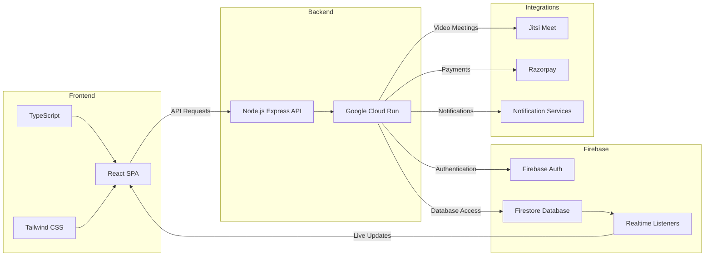

---

# 2. Patient Authentication Workflow

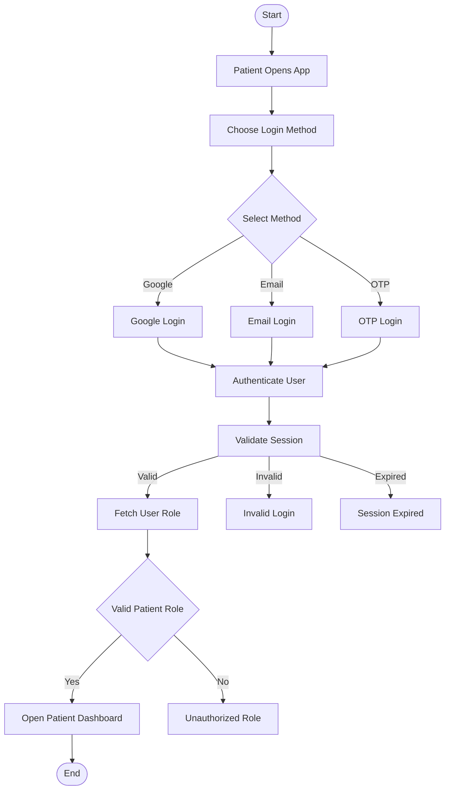

---

# 3. Patient Booking Workflow

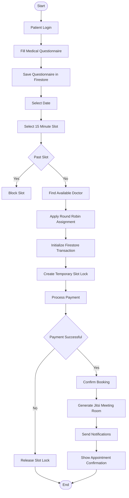

---

# 4. Smart Doctor Assignment Workflow

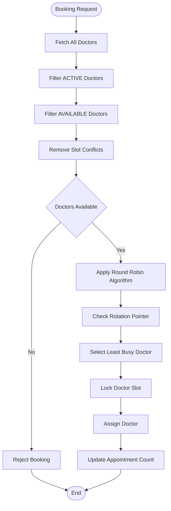

---

# 5. Slot Locking and Collision Prevention Workflow

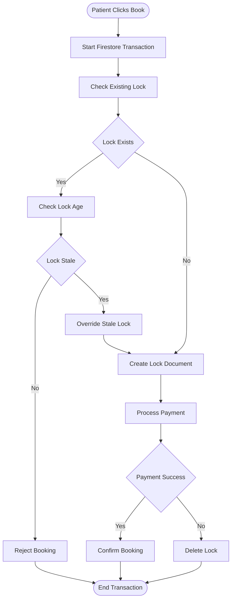

---

# 6. Doctor Registration and Approval Workflow

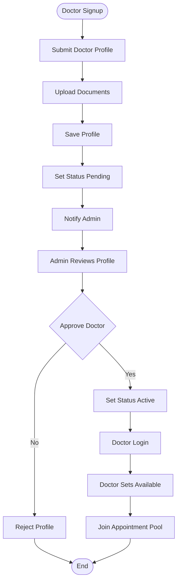

---

# 7. Payment Workflow

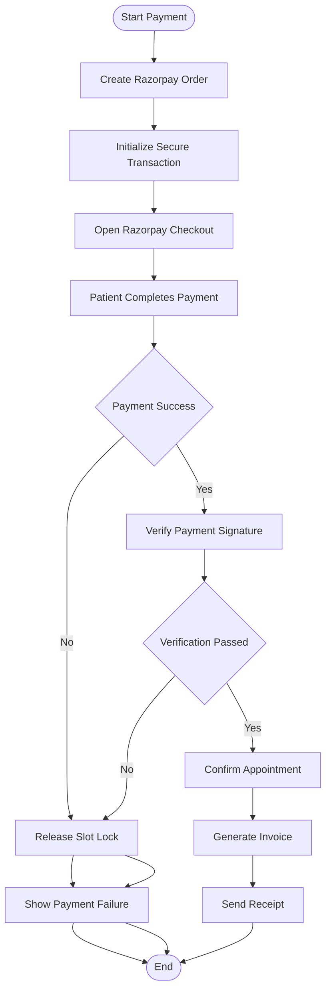

---

# 8. Video Consultation Workflow

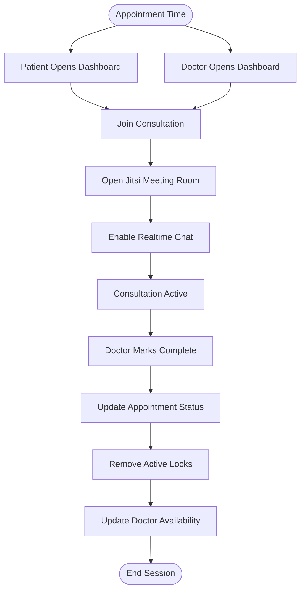

---

# 9. Notification Workflow

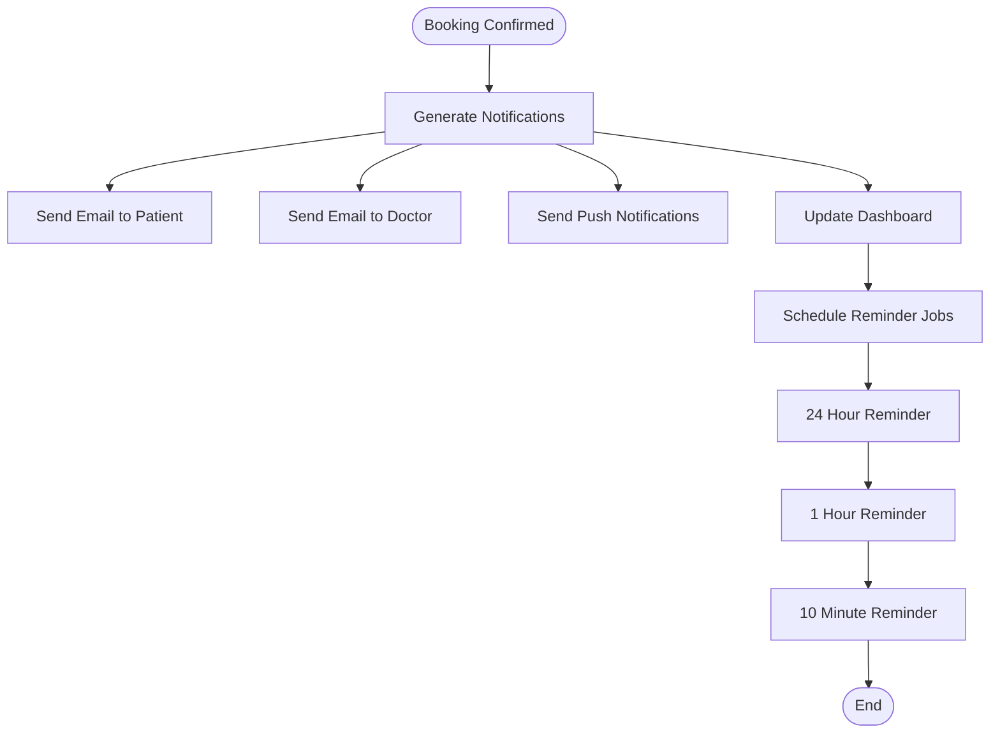

---

# 10. Realtime Synchronization Workflow

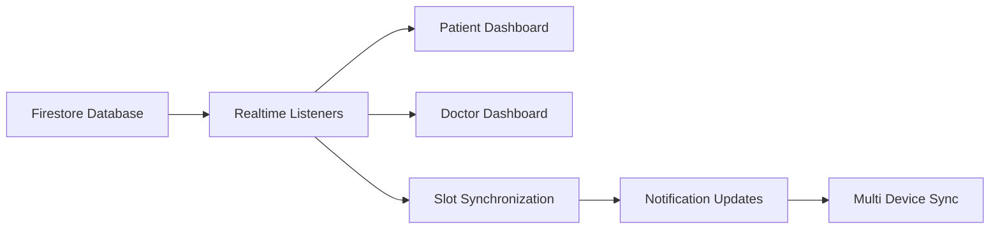

---

# 11. Database Relationship Diagram

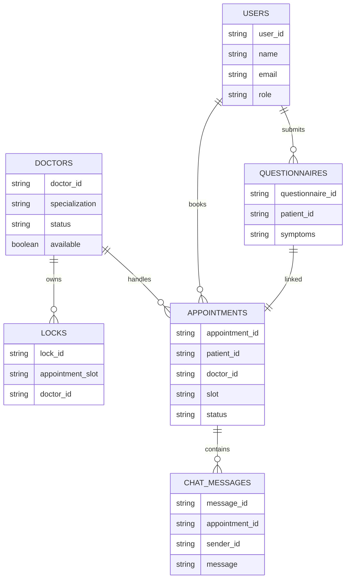

---

# 12. Appointment Lifecycle State Machine

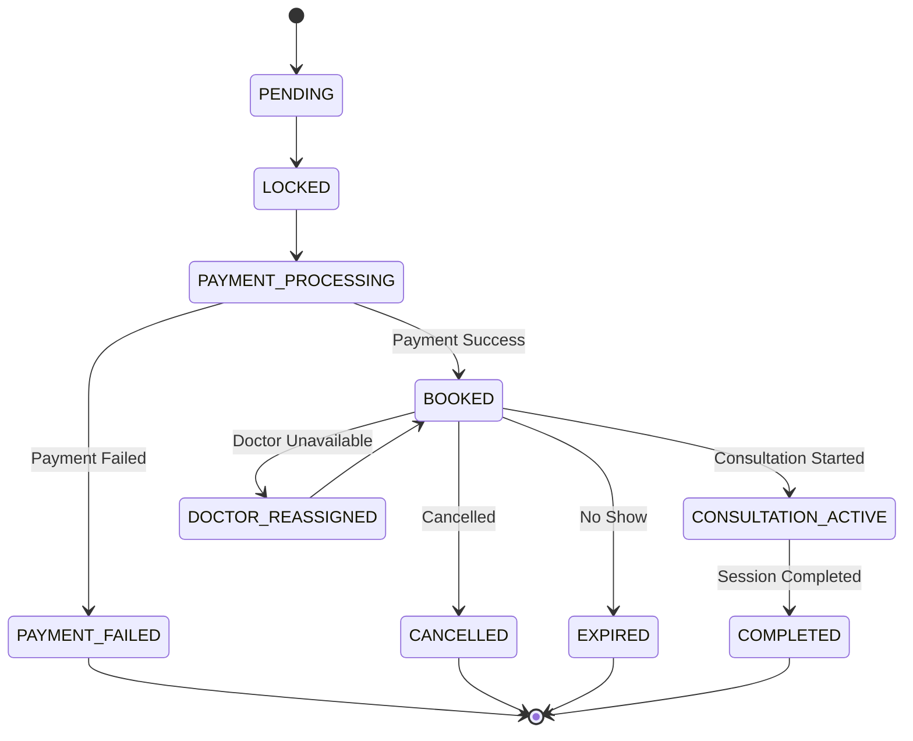

---

# Production Engineering Notes

## Scalability Features

- Stateless backend architecture using Google Cloud Run
- Firestore realtime synchronization
- Horizontal API scaling
- Distributed lock handling
- Atomic Firestore transactions
- Event-driven notification system

---

# Security Features

- Firebase Authentication
- JWT Session Validation
- Role-Based Access Control (RBAC)
- Secure Payment Verification
- Protected Video Sessions
- Firestore Security Rules

---

# Reliability Features

- Slot collision prevention
- Realtime synchronization
- Transaction rollback handling
- Stale lock cleanup
- Multi-device synchronization support
- Doctor failover assignment

---

# Technology Stack

| Layer | Technology |
|---|---|
| Frontend | React + TypeScript + Tailwind CSS |
| Backend | Node.js + Express.js |
| Hosting | Google Cloud Run |
| Database | Firebase Firestore |
| Authentication | Firebase Authentication |
| Video Calls | Jitsi Meet |
| Payments | Razorpay |
| Notifications | Firebase + Email Services |
| Realtime Sync | Firestore Realtime Listeners |

---

# End of Documentation
